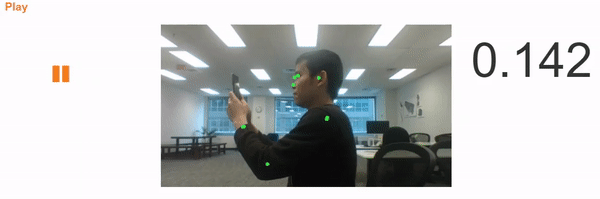

# UpRight ⬆
A fast real-time posture detection app run in modern browsers, powered by [TensorFlow](https://js.tensorflow.org/).

---
#### Requirement
- Firefox or Chrome browser (desktop)
- Permission to access webcam

---
### Why?
- We spend on average ~8 hours per day on computers, phone, TV and usually in a suboptimal posture ☹.
- This can cause health problems and leads to lower productivity.
- **Solution**: a web app to track your posture and notify you when you deviate from the "optimal" posture or have been sitting for too long.

---
### Tech stacks
- Python
- Numpy
- Keras
- TensorFlow
- Convolution neural network
- PoseNet
- JavaScript
- HTML5 Media Stream API

---
### Road map 🗺
- Multi-people support
- Notification system: text message, push notification
- Mobile device support 📱
- Medically certified labels 👨‍⚕️
- Accuracy improvement 📈
- Data at various angles
- Gamification 🎮

